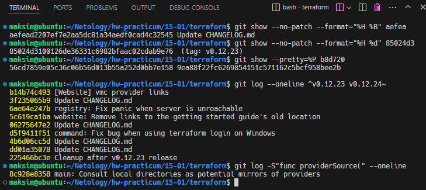
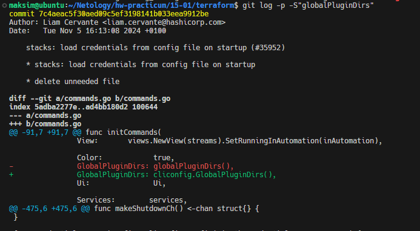
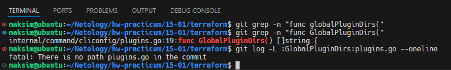
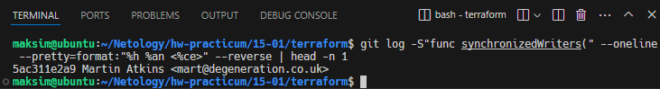

# Домашнее задание к занятию «Инструменты Git»

## Задание

В клонированном [репозитории](https://github.com/hashicorp/terraform):

1. Найдите полный хеш и комментарий коммита, хеш которого начинается на `aefea`.
2. Ответьте на вопросы.

* Какому тегу соответствует коммит `85024d3`?
* Сколько родителей у коммита `b8d720`? Напишите их хеши.
* Перечислите хеши и комментарии всех коммитов, которые были сделаны между тегами  v0.12.23 и v0.12.24.
* Найдите коммит, в котором была создана функция `func providerSource`, её определение в коде выглядит так: `func providerSource(...)` (вместо троеточия перечислены аргументы).
* Найдите все коммиты, в которых была изменена функция `globalPluginDirs`.
* Кто автор функции `synchronizedWriters`? 

*В качестве решения ответьте на вопросы и опишите, как были получены эти ответы.*

#### Ответ

1. Полный хеш и комментарий коммита, хеш которого начинается на `aefea`:

    Полный хеш коммита: `aefead2207ef7e2aa5dc81a34aedf0cad4c32545`
    Комментарий: `Update CHANGELOG.md`

    Git-команда №1:
    ```bash
    git show --no-patch --format="%H %B" aefea
    ```

2. Какому тегу соответствует коммит `85024d3`?

    Тег: `v0.12.23`

    Git-команда №2:
    ```bash
    git show --no-patch --format="%H %d" 85024d3
    ```

3. Сколько родителей у коммита `b8d720`? Напишите их хеши:

    Хеши родителей:
    
    ```
    56cd7859e05c36c06b56d013b55a252d0bb7e158 9ea88f22fc6269854151c571162c5bcf958bee2b
    ```

    Git-команда №3:

    ```bash
    git show --pretty=%P b8d720
    ```

4. Перечислите хеши и комментарии всех коммитов, которые были сделаны между тегами  v0.12.23 и v0.12.24:

    Хеши и комментарии:
    ```
    b14b74c493 [Website] vmc provider links
    3f235065b9 Update CHANGELOG.md
    6ae64e247b registry: Fix panic when server is unreachable
    5c619ca1ba website: Remove links to the getting started guide's old location
    06275647e2 Update CHANGELOG.md
    d5f9411f51 command: Fix bug when using terraform login on Windows
    4b6d06cc5d Update CHANGELOG.md
    dd01a35078 Update CHANGELOG.md
    225466bc3e Cleanup after v0.12.23 release
    ```
    
    Git-команда №4:

    ```bash
    git log --oneline ^v0.12.23 v0.12.24~
    ```

    `v0.12.24~` или `v0.12.24^` обозначает родительский коммит тега v0.12.24, исключая сам коммит из результата.

5. Поиск коммита, в котором была создана функция `func providerSource`:

    Коммит:

    ```
    8c928e8358 main: Consult local directories as potential mirrors of providers
    ```

    Git-команда №5:

    ```bash
    git log -S"func providerSource(" --oneline
    ```

Выполнение git-команд с 1 по 5:




6. Поиск всех коммитов, в которых была изменена функция `globalPluginDirs`:

    При выполнении команды `git grep "func globalPluginDirs("` видим, что ни в одном файле функции нет.

    Выполнив команду `git log -p -S"globalPluginDirs"` видим, что функуию заменили на `cliconfig.GlobalPluginDirs`:
    
    ```
    commit 7c4aeac5f30aed09c5ef3198141b033eea9912be
    Author: Liam Cervante <liam.cervante@hashicorp.com>
    Date:   Tue Nov 5 16:13:08 2024 +0100
    ```
    
    

    Выполняем поиск файла, где объявляется новая функция:

    ```bash
    git grep -n "func GlobalPluginDirs("
    ```

    Новая функция `GlobalPluginDirs` ни в одном коммите не изменялась:

    ```bash
    git log -L :GlobalPluginDirs:plugins.go --oneline
    ```

    

7. Кто автор функции synchronizedWriters?

    Автор: `Martin Atkins <mart@degeneration.co.uk>`
    
    Смотрим самый первый коммит:

    ```bash
    git log -S"func synchronizedWriters(" --oneline --pretty=format:"%h %an <%ce>" --reverse | head -n 1
    ```

    

---

